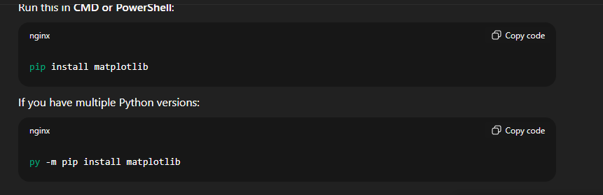

# why we use {python -m pip x} instead of {pip x}

-m tells Python: execute a module as a script
📌 Interpreter and installer are locked together
basically "python -m pip" is Equivalent to "python path/to/pip/__main__.py"

ALso:
py -3.11 -m pip install requests

```bat
    py -3.11 -m pip install requests
```
```bat
    python -m pip
```
# For Example :

